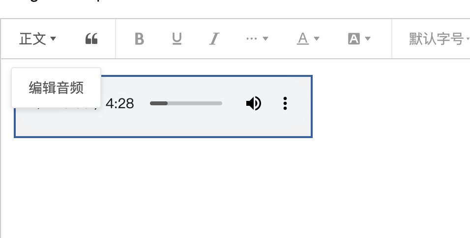

# wangEditor upload-audio plugin

[中文文档](./README.md)

# Only for learning

## Introduction

[wangEditor](https://www.wangeditor.com/en/) upload audio plugin.



## Installation

```shell
npm i itxve/wangeditor-plugin-audio
```

## Usage

### Register to editor

```js
import { Boot } from '@wangeditor/editor'
import audioModule from '@itxve/plugin-upload-audio'

// Register
// You should register this before create editor, and register only once (not repeatedly).
Boot.registerModule(audioModule)
```

### Configuration

Editor config

```ts
import { IEditorConfig } from '@wangeditor/editor'

const editorConfig: Partial<IEditorConfig> = {
  // Hoverbar keys when selected a audio node.
  hoverbarKeys: {
    audio: {
      menuKeys: ['editAudio'], // edit audio menu
    },
  },
  MENU_CONF: {
    // upload audio menu config
    uploadAudio: {
      server: '/api/upload', // server address
      timeout: 5 * 1000, // 5s

      fieldName: 'custom-fileName',
      meta: { token: 'xxx', a: 100 },
      metaWithUrl: true,
      headers: { Accept: 'text/x-json' },

      maxFileSize: 10 * 1024 * 1024, // 10M

      onBeforeUpload(file: File) {
        console.log('onBeforeUpload', file)
        return file // upload this `file`
        // return false // ignore this `file`
      },
      onProgress(progress: number) {
        console.log('onProgress', progress)
      },
      onSuccess(file: File, res: any) {
        console.log('onSuccess', file, res)
      },
      onFailed(file: File, res: any) {
        alert(res.message)
        console.log('onFailed', file, res)
      },
      onError(file: File, err: Error, res: any) {
        alert(err.message)
        console.error('onError', file, err, res)
      },
     
      // customInsert(res: any, file: File, insertFn: InsertAudioFn) {
      //   console.log('customInsert', res)
      //   const { url } = res.data || {}
      //   if (!url) throw new Error(`url is empty`)

      //   // insert to editor
      //   insertFn(url)
      // },

      // customUpload(file: File, insertFn: InsertAudioFn) {
      //   console.log('customUpload', file)

      //   return new Promise(resolve => {
      //     setTimeout(() => {
      //       const src = `https://www.w3school.com.cn/i/movie.ogg`
      //       insertFn(src)
      //       resolve('ok')
      //     }, 500)
      //   })
      // },

      // customBrowseAndUpload(insertFn: InsertAudioFn) {
      //   alert('select your files')
      //   // upload your files
      //   // Do `insertFn(link)` to insert file into editor.
      // },
    },
    insertAudio: {
    /**
     * Check the Audio information, support async fn
     * @param src audio src
     */
    checkAudio(src: string): boolean | string | undefined {
      //  1. Returns true to indicate that the check passed
      //  2. Returns a string indicating that the check failed, and the editor will prevent the image from being inserted. Will alert out the error message (i.e. the returned string)
      //  3. Returns undefined (i.e. nothing is returned), indicating that the check failed and the editor prevents the image from being inserted
      return true
    },

     /**
     * format audio src
     * @param src audio src
     * @returns new src
     */
    formatAudioSrc(src: string): string {
      return src
    },
    onInsertedAudio(audioNode: AudioElement): void {},
    },
  },

  // others...
}
```

Toolbar config

```ts
import { IToolbarConfig } from '@wangeditor/editor'

const toolbarConfig: Partial<IToolbarConfig> = {
  // insert some menus in toolbar
  insertKeys: {
      index: -1, //Later position
      keys: [
        {
          key: 'group-audio',
          title: t('audio.insert'),
          iconSvg: AUDIO_SVG, //
          menuKeys: ['insertAudio', 'uploadAudio'],
        },
      ], // Upload Audio menu
    },

  // others...
}
```

Then create editor and toolbar, you will use `editorConfig` and `toolbarConfig`

### Server response format

Success:

```json
{
  "errno": 0,
  "data": {
    "url": "link of audio"
  }
}
```

Failed，will trigger `onFailed` function.

```json
{
  "errno": 1,
  "message": "Error message"
}
```

### Render HTML

You will get a audio's HTML format like this

```html
<span data-w-e-type="audio"  data-w-e-is-void data-w-e-is-inline ><audio controls src="http://127.0.0.1:3000/upload-files/aa.mp3">audio not support </audio><span>
```

## Others

Support i18n.
